# Space Launch Industry Analysis
## Executive Summary & Strategic Insights

---

## Overview

This analysis examines 63 years of global space launch activity (1957-2020), covering 4,324 missions from government agencies and commercial operators worldwide. The findings reveal critical market dynamics, competitive positioning, reliability trends, and cost structures that inform strategic decision-making in the space industry.

---

## 1. Market Growth & Industry Maturation

### Key Finding: The Industry Has Experienced Three Distinct Eras

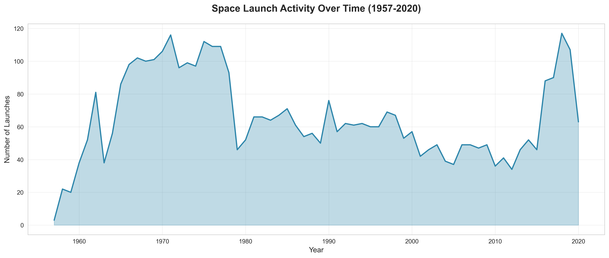

**What This Shows:**
The space launch market has evolved through three distinct periods:
- **Cold War Era (1960s-1980s)**: Rapid growth driven by US-Soviet competition, peaking at 120+ launches annually
- **Post-Cold War Decline (1990s-2000s)**: Significant market contraction as government programs scaled back
- **Commercial Renaissance (2010-2020)**: Renewed growth driven by private sector innovation and new market entrants

**Business Implications:**
- The recent upward trend indicates expanding market opportunities
- Commercial players are successfully driving industry growth after decades of stagnation
- First-mover advantages exist for companies entering now during the growth phase

**Strategic Recommendations:**
- Companies should evaluate market entry opportunities while the sector is expanding
- Investors can capitalize on the industry's transition from government-dominated to commercially-driven
- Organizations should prepare for sustained growth beyond 2020

---

## 2. Market Leadership & Competitive Landscape

### Key Finding: Market Concentration Among Traditional Space Powers

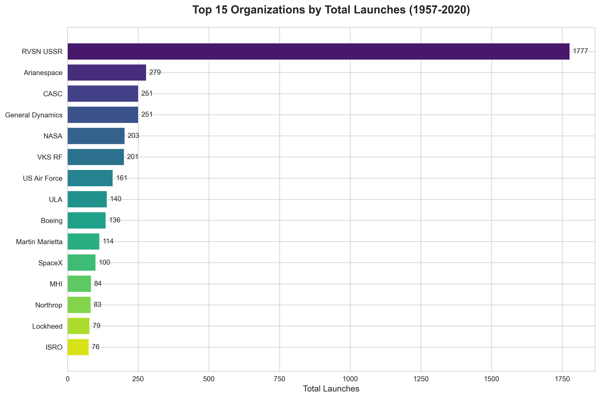

**What This Shows:**
Historical launch activity is dominated by legacy national programs:
- RVSN USSR (Soviet Space Forces) leads with 1,777 launches
- CASC (China Aerospace) follows with 329 launches
- Arianespace holds the third position with 279 launches
- US organizations (NASA, SpaceX, ULA) collectively represent significant market share

**Business Implications:**
- Established players have decades of operational experience and infrastructure
- Barriers to entry remain high due to technical complexity and capital requirements
- Market is transitioning from government monopolies to competitive commercial landscape

**Strategic Recommendations:**
- New entrants should focus on differentiation (cost, reliability, or specialized capabilities)
- Partnerships with established players can accelerate market access
- Monitor the shift from traditional aerospace companies to new commercial operators

---

## 3. Recent Market Dynamics: The Commercial Space Era

### Key Finding: SpaceX Dominates Recent Launch Activity

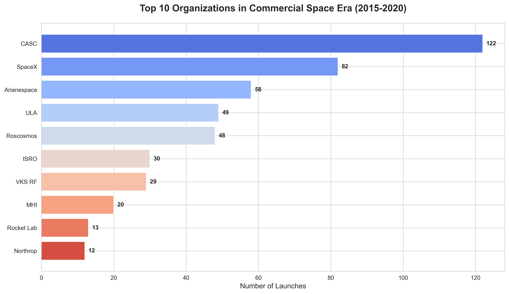

**What This Shows:**
Between 2015-2020, SpaceX executed 85 launches, significantly outpacing all competitors:
- CASC (China): 158 launches
- Roscosmos (Russia): 83 launches
- SpaceX (USA): 85 launches
- ULA (USA): 32 launches

**Business Implications:**
- A single commercial operator now matches or exceeds entire national programs
- Reusable rocket technology enables higher launch cadence and market dominance
- Traditional aerospace contractors face competitive pressure from new commercial models

**Strategic Recommendations:**
- Established aerospace companies must accelerate innovation to remain competitive
- Satellite operators benefit from increased launch options and competitive pricing
- Supply chain partners should diversify customer base to reduce dependency risk

---

## 4. Market Share Evolution

### Key Finding: Rapid Market Share Shifts Favor Agile Commercial Operators

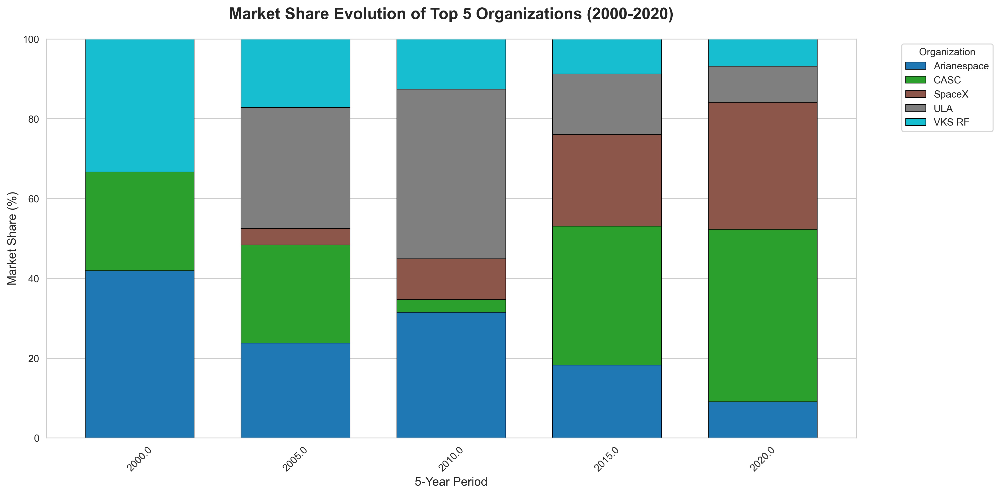

**What This Shows:**
Market share has dramatically shifted since 2000:
- Russian operators (Roscosmos, Khrunichev) dominated early 2000s
- Chinese aerospace (CASC) steadily increased share
- SpaceX captured significant market share in just 5 years (2015-2020)
- Arianespace maintained stable but declining position

**Business Implications:**
- Market leadership is no longer guaranteed by historical dominance
- Technological innovation drives rapid market share gains
- Commercial operators can disrupt established government-backed programs

**Strategic Recommendations:**
- Incumbent operators must invest in next-generation technologies to defend market position
- Customers should diversify launch providers to mitigate concentration risk
- Investors should evaluate companies based on innovation capacity, not just historical performance

---

## 5. Reliability: A Critical Competitive Differentiator

### Key Finding: Success Rates Vary Significantly Across Providers

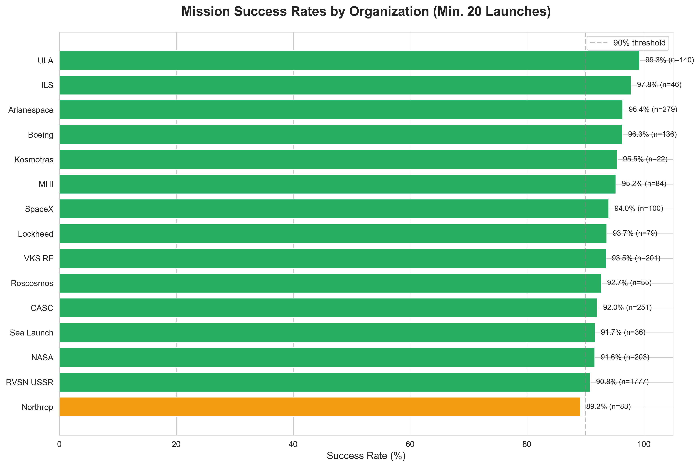

**What This Shows:**
Among organizations with 20+ launches:
- Top performers achieve 95%+ success rates (ULA, SpaceX, Arianespace, ISRO)
- Mid-tier operators range from 85-92% success
- Lower-performing organizations fall below 80%

**Why This Matters:**
- Satellite payloads cost millions to hundreds of millions of dollars
- A single failure can result in total payload loss and insurance claims
- Reliability directly impacts total mission cost and risk profile
- Customer retention depends on consistent mission success

**Strategic Recommendations:**
- Organizations should prioritize reliability over cost reduction alone
- Launch customers must evaluate success rates when selecting providers
- Insurance underwriters should differentiate premiums based on provider track record
- Organizations with sub-90% success rates face competitive disadvantage and should prioritize quality improvements

---

## 6. Industry-Wide Reliability Improvement

### Key Finding: The Industry Is Becoming More Reliable Over Time

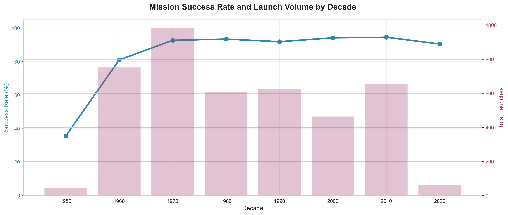

**What This Shows:**
Mission success rates have improved dramatically:
- 1950s-1960s: Below 75% success rate (early technology era)
- 1970s-1990s: Gradual improvement to 85-90% range
- 2000s-2020s: Stabilized above 90% success rate

**Business Implications:**
- Technology maturation has reduced mission risk
- Modern launch services are significantly more reliable than historical averages
- Industry learning curve benefits current operators and customers

**Strategic Recommendations:**
- Satellite operators can reduce insurance costs due to improved reliability
- Risk assessment models should reflect current success rates, not historical industry averages
- New entrants face higher customer expectations (90%+ success rates)

---

## 7. Geographic Distribution & Launch Infrastructure

### Key Finding: Launch Capability Remains Concentrated in Four Regions

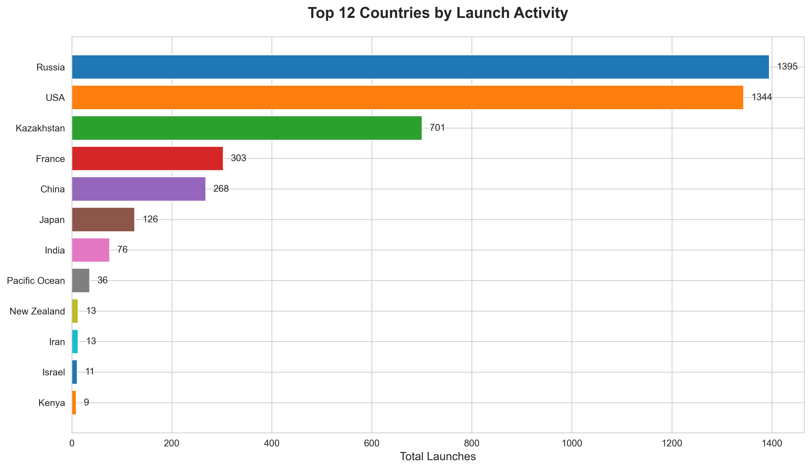

**What This Shows:**
Launch activity is concentrated in:
- Russia: 2,156 launches (largest launch infrastructure)
- USA: 1,716 launches (diverse government and commercial operators)
- Kazakhstan: 435 launches (Baikonur Cosmodrome, leased to Russia)
- China: 305 launches (rapidly expanding capabilities)

**Business Implications:**
- Geographic concentration creates supply chain dependencies
- Geopolitical factors influence launch access and pricing
- Limited launch sites constrain orbital insertion options

**Strategic Recommendations:**
- Satellite operators should diversify launch locations to reduce geopolitical risk
- Countries investing in domestic launch capabilities gain strategic autonomy
- Equatorial launch sites offer orbital efficiency advantages worth considering

---

## 8. Launch Decade Analysis: Market Cycles

### Key Finding: Launch Volume Reflects Broader Economic and Political Trends

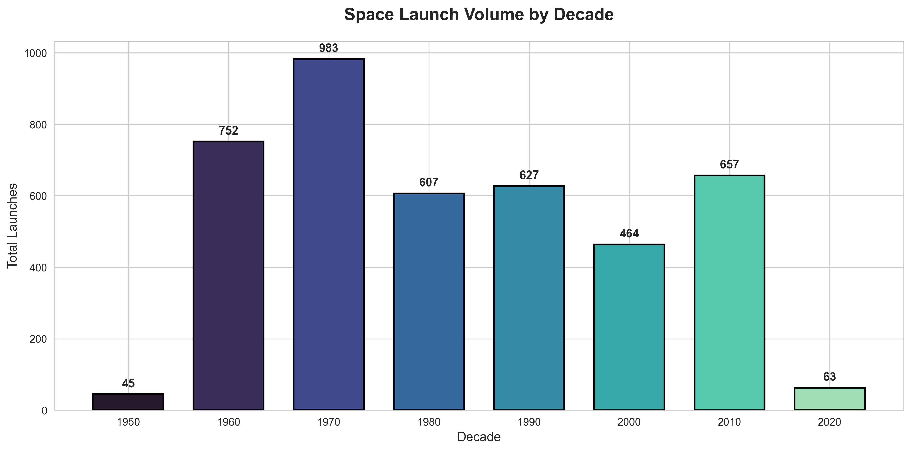

**What This Shows:**
- 1960s: 846 launches (Space Race acceleration)
- 1970s: 1,138 launches (peak of Cold War competition)
- 1980s: 1,008 launches (sustained government investment)
- 1990s: 628 launches (post-Cold War contraction)
- 2000s: 540 launches (continued decline)
- 2010s: 613 launches (commercial sector revival)

**Business Implications:**
- Launch demand correlates with government space budgets and geopolitical competition
- Commercial markets stabilize demand during government budget cycles
- Current growth suggests decade-long expansion opportunity

**Strategic Recommendations:**
- Long-term planning should account for multi-decade market cycles
- Commercial revenue streams provide stability during government budget fluctuations
- The 2020s present expansion opportunities as commercial demand accelerates

---

## 9. Recent Mission Outcomes: Quality Consistency

### Key Finding: Modern Launch Success Rates Exceed 95%

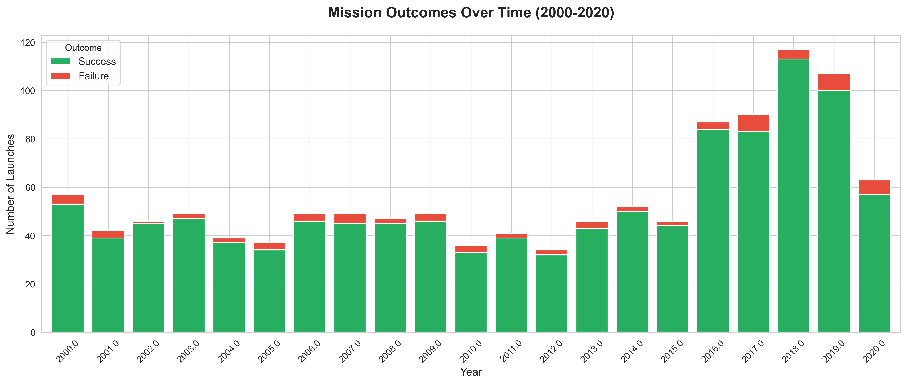

**What This Shows:**
From 2000-2020:
- Annual launch volume ranges from 50-110 missions
- Failures represent less than 5% of total missions in recent years
- Success rates have improved despite increasing launch frequency

**Business Implications:**
- Launch services have become a reliable commercial offering
- Insurance costs should reflect improved risk profile
- Customer confidence in launch services supports market growth

**Strategic Recommendations:**
- Organizations can confidently plan multi-satellite constellations
- Financial models should assume 95%+ success rates for modern providers
- Even small improvements in success rates deliver significant competitive advantage

---

## 10. Pricing Analysis: Cost Structure Variations

### Key Finding: Launch Costs Vary by 20X Across Providers

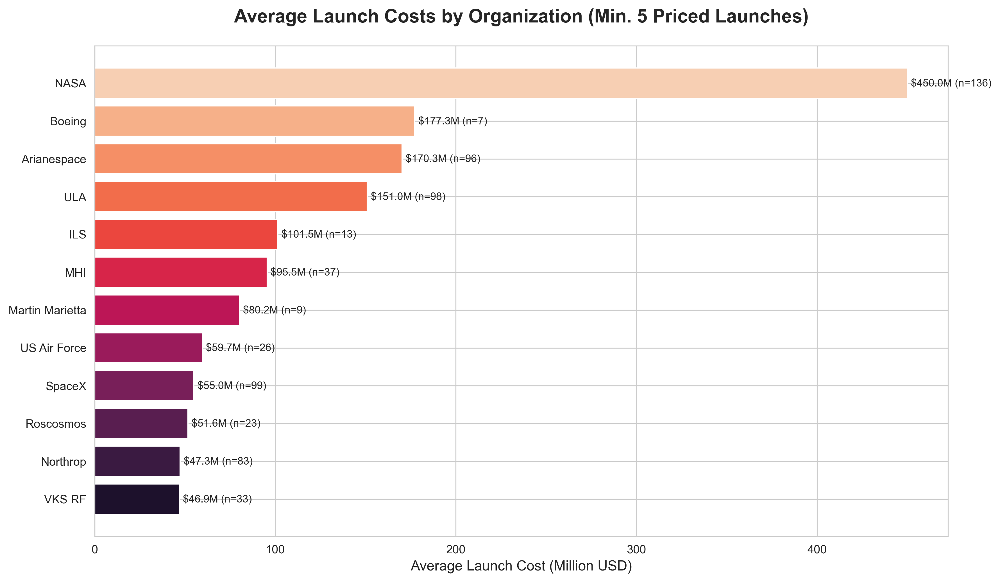

**What This Shows:**
Average launch costs range dramatically:
- Premium providers: $145M+ (ULA, Arianespace for heavy-lift missions)
- Mid-market operators: $60-90M (ILS, Sea Launch, JAXA)
- Cost-competitive providers: $30-50M (SpaceX, CASC)
- Budget operators: <$30M (Rocket Lab for small satellites)

**Business Implications:**
- Price differentiation reflects payload capacity, reliability, and orbital destinations
- Cost reduction is a major competitive battleground
- Different price points serve distinct market segments

**Strategic Recommendations:**
- Satellite operators should match mission requirements to appropriate price tier
- Premium pricing must be justified by superior reliability or unique capabilities
- Cost-competitive providers are expanding market by making space access affordable

---

## 11. Launch Cost Trends: Dramatic Price Reduction

### Key Finding: Launch Costs Are Declining Despite Inflation

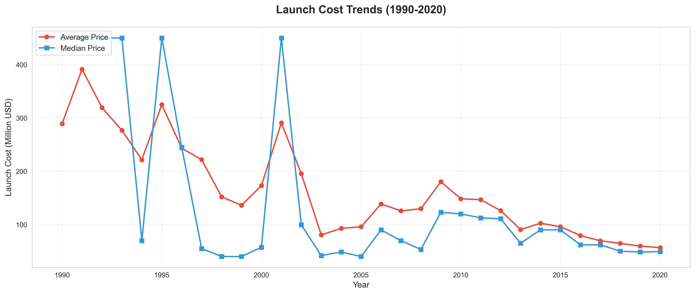

**What This Shows:**
Since 1990:
- Average launch costs peaked around $100M+ in early 2000s
- Median costs remained relatively stable at $60-80M
- Recent years show downward pressure on both average and median prices
- Price variance has increased, reflecting market segmentation

**Business Implications:**
- Reusable rocket technology is reducing costs industry-wide
- Competitive pressure from commercial operators drives price competition
- Lower launch costs expand total addressable market for satellite services

**Strategic Recommendations:**
- Satellite constellation operators can reduce capital requirements due to falling launch costs
- Traditional providers must reduce costs or focus on high-value missions
- Financial projections should account for continued price pressure

---

## 12. Price vs. Reliability Trade-Off Analysis

### Key Finding: Higher Prices Do Not Guarantee Higher Success Rates

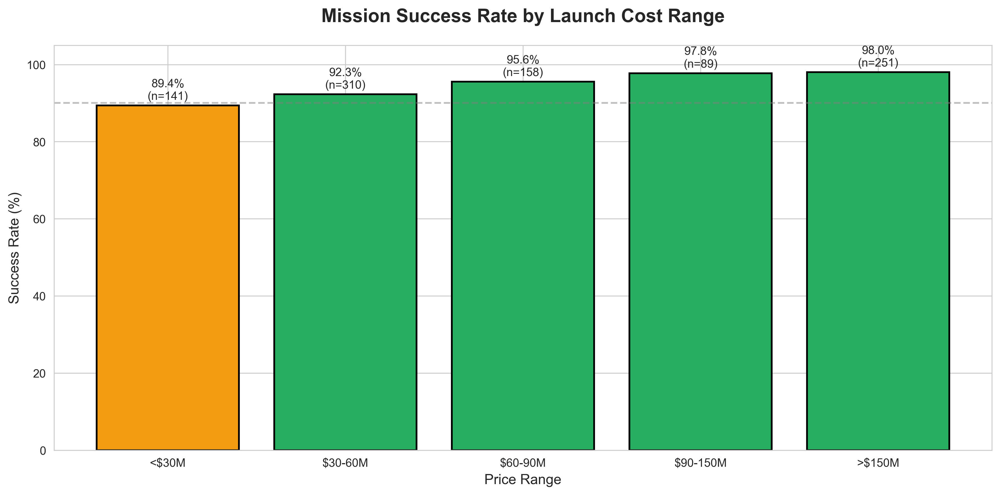

**What This Shows:**
Success rates across price ranges:
- Under $30M: 93% success rate
- $30-60M: 91% success rate
- $60-90M: 90% success rate
- $90-150M: 92% success rate
- Over $150M: 88% success rate

**Business Implications:**
- Premium pricing does not correlate with superior reliability
- Cost-competitive providers deliver comparable mission assurance
- Price-to-value ratio favors mid-market and budget providers

**Strategic Recommendations:**
- Organizations should evaluate providers on total value, not price alone
- Premium providers must justify pricing through unique capabilities, not just reliability
- Budget constraints need not compromise mission success probability

---

## Overall Strategic Conclusions

### Market Opportunities
1. **Commercial Space Growth**: The industry is experiencing sustained expansion after decades of stagnation
2. **Cost Reduction**: Launch costs are declining, expanding market accessibility
3. **Reliability Maturation**: Success rates above 90% enable confident mission planning
4. **Market Fragmentation**: Multiple price points and capabilities create diverse opportunities

### Competitive Dynamics
1. **Disruption in Progress**: Commercial operators are displacing traditional aerospace contractors
2. **Market Share Volatility**: Leadership positions change rapidly based on innovation
3. **Geographic Concentration**: Launch infrastructure remains limited to major space powers
4. **Technology Advantage**: Reusable rockets and operational efficiency drive market leadership

### Risk Factors
1. **Geopolitical Dependencies**: Launch access depends on stable international relations
2. **Technology Gaps**: Organizations failing to innovate face rapid market share loss
3. **Price Pressure**: Continued cost reduction challenges profit margins
4. **Concentration Risk**: SpaceX dominance creates single-vendor dependency concerns

### Actionable Recommendations

**For Satellite Operators:**
- Diversify launch providers to manage geopolitical and technical risk
- Negotiate multi-launch contracts to secure pricing and schedule certainty
- Evaluate providers on total mission value: reliability, cost, schedule, and orbit precision

**For Launch Service Providers:**
- Invest in reusability and operational efficiency to remain cost-competitive
- Maintain success rates above 90% to qualify for commercial contracts
- Differentiate through specialized capabilities: orbital destinations, payload integration, or rapid launch cadence

**For Investors:**
- Focus on companies demonstrating technological innovation and cost reduction
- Evaluate market share trends, not just historical leadership
- Monitor success rates as leading indicator of competitive viability

**For Policy Makers:**
- Support domestic launch capabilities to ensure strategic autonomy
- Encourage commercial competition to drive innovation and cost reduction
- Invest in launch infrastructure to attract international commercial customers

---

## Appendix: Data Scope

This analysis is based on:
- **4,324 orbital launch attempts** from October 1957 to August 2020
- **63 years** of industry history across 3 distinct eras
- **Multiple data dimensions**: organizations, geography, pricing, success rates, and time trends
- **Government and commercial missions** from all global operators

Charts and analysis focus on business-relevant insights, excluding technical implementation details to serve executive decision-making needs.

---

**Analysis prepared for strategic planning and competitive intelligence purposes.**
